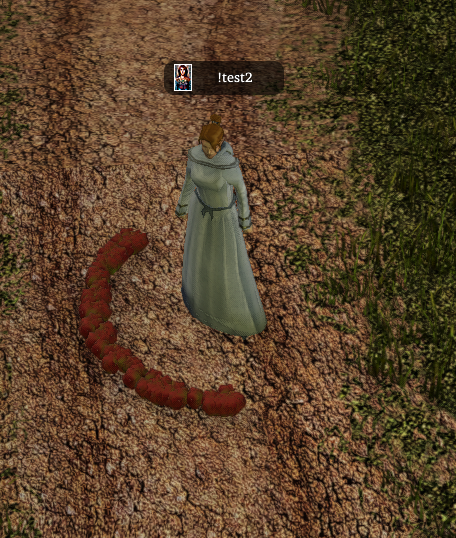
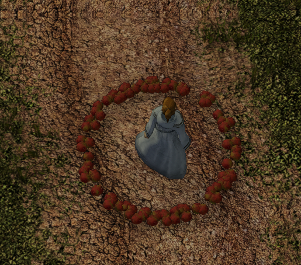

# nwnscript-fixes

These are non-breaking fixes, tweaks and clean ups for NWN:EE (currently targetting .34).  These should be drop in replacements for toolset or nwnsc.


<hr>

# Changes

#### x0_i0_anims.nss

Fixed function declaration to remove warning when compiling under nwnsc

Before: 
`(1261): Warning: NSC6023: Function "AnimActionPlayRandomGreeting" argument "nHDiff" default value does not match the initializer value for a previous declaration.  The first declaration value will be used.`

#### x2_inc_switches

Fixed function declaration to remove warning when compiling under nwnsc

Before: 
`x2_inc_switches.nss(596): Warning: NSC6023: Function "SetExecutedScriptReturnValue" argument "nValue" default value does not match the initializer value for a previous declaration.  The first declaration value will be used.`

#### x2_inc_restsys

Fixed function declaration to remove warning when compiling under nwnsc

Before: 
`x2_inc_restsys.nss(685): Warning: NSC6023: Function "WMSetAreaTable" argument "nListenCheckDC" default value does not match the initializer value for a previous declaration.  The first declaration value will be used.`

#### nwnscript.nss

### Constants 

##### ACTION_MODE_DEFENSIVE_STANCE

Added ACTION_MODE_DEFENSIVE_STANCE
See: https://nwnlexicon.com/index.php?title=ACTION_MODE

##### FEAT_SKILL_FOCUS_APPRAISE

Added FEAT_SKILL<font color="red">\_</font>FOCUS_APPRAISE.  It's referenced as FEAT_SKILLFOCUS_APPRAISE, but this new name reflects naming convetation of other FEAT_SKILL<font color=red>\_</font>FOCUS_XXX.

##### IP_CONST_MATERIAL_*

Added IP_CONST_MATERIAL_* values as they were missing.
See: https://nwnlexicon.com/index.php?title=ItemPropertyMaterial
Values taken from: ./pkg2.bif/iprp_material.2da

### GetFirstObjectInArea / GetNextObjectInArea
Added optional parameter to filter by type.  See: https://nwnlexicon.com/index.php?title=GetFirstObjectInArea

### GetRandomLocation
Fixed so it returns a random location in a full 360 range instead of 180.

**Before:**



**After:**

 


### New variables

Added these variables: 

```
////////////////////////////////////////////////////////
// Added by nwnscript-fixes
// our current version
int NWNSF_VERSION = 2;
// minor version of nwnscript.nss that this is based on
int NWNSF_BASED = 34;
////////////////////////////////////////////////////////
```